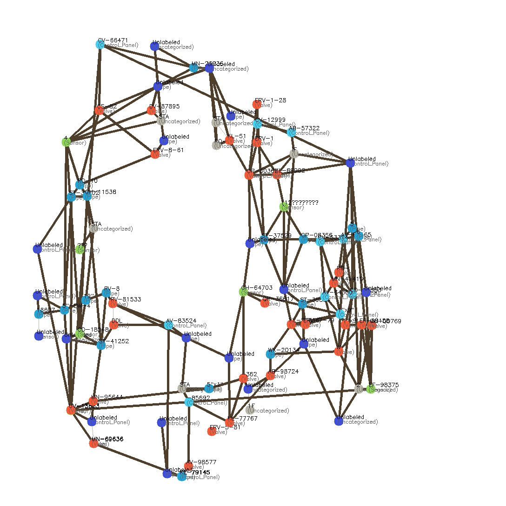

# 🛠️ P&ID Diagram Symbol Detection and Graph Construction

This project leverages deep learning (YOLO), Optical Character Recognition (PaddleOCR), and computer vision techniques (OpenCV) to automatically detect symbols in Process & Instrumentation Diagrams (P&IDs), extract surrounding textual information, and construct an intelligent graph representing the relationships between components.

---

## 🚀 Features

- **Symbol Detection:** Uses YOLOv8 model to detect predefined industrial symbols like valves, sensors, pipes, and more.
- **Text Extraction:** OCR using PaddleOCR around each detected object to extract labels and annotations.
- **Smart Labeling:** Dynamically scores and assigns the most relevant label to each symbol using proximity, angle, and OCR confidence.
- **Line Detection:** Uses Hough Transform to detect connection lines between components.
- **Graph Construction:** Builds a `NetworkX` graph where:
  - Nodes represent symbols
  - Edges represent physical (line-based) or proximity-based connections
- **Graph Visualization:** Annotated graph is saved as an image using OpenCV, color-coded by component type.

---
---

## 🧠 Technologies Used

- **[YOLOv8 (Ultralytics)](https://docs.ultralytics.com/):** For object (symbol) detection.
- **[PaddleOCR](https://github.com/PaddlePaddle/PaddleOCR):** For extracting text around each symbol.
- **OpenCV:** For image preprocessing and visualization.
- **NetworkX:** For creating a graph structure from symbols and line connections.
- **Shapely & SciPy:** For geometry and spatial relationships.

---

## 🖼️ Example Output

After processing a P&ID diagram:

- Each symbol is detected and labeled with nearby OCR text.
- A graph is generated and stored as `generated_graph.jpg` with color-coded nodes and labeled edges.



---

## ⚙️ How to Use

### 1. Clone the repository

```bash
git clone https://github.com/your-username/pid-symbol-graph.git
cd pid-symbol-graph
```

### 2. Install dependencies

Make sure you have Python 3.8+.

```bash
pip install -r requirements.txt
```

> You may also need to install PaddleOCR with GPU support if needed:
```bash
pip install paddleocr
pip install paddlepaddle-gpu
```

### 3. Add your YOLOv8 model

Place your trained `best.pt` file in the root directory.

### 4. Run the graph generator

```python
from main import makegraph

makegraph("path/to/your/image.jpg")
```

Output will be saved at `static/predict/generated_graph.jpg`.

---

## 🎯 Symbol Categories

The model currently supports detection of the following types:

- Valve
- Pipe
- Sensor
- Control Panel
- Uncategorized

Add more classes by retraining the YOLOv8 model.

---

## 🧩 Future Enhancements

- Export graph structure as JSON or GEXF.
- Interactive graph visualization in a web app.
- Support for more symbol types and directional arrows.
- Better alignment heuristics for rotated text.


